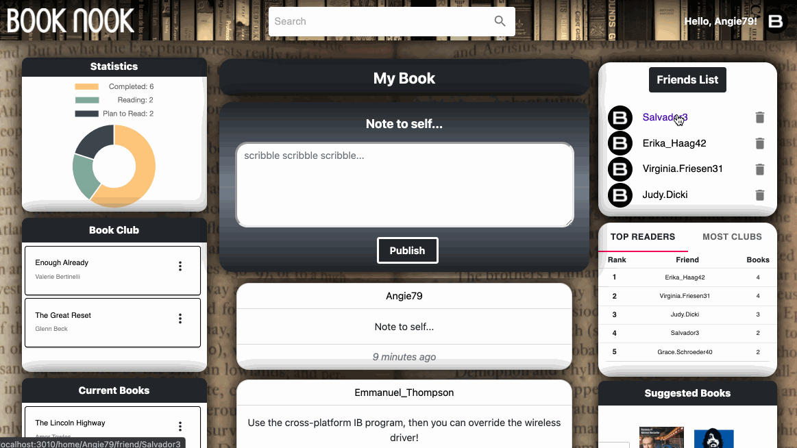

#  Book-Nook

## Table of Contents

1. [General Info](#general-info)
2. [Demo](#demo)
3. [API Services](#api-services)
4. [Technologies Used](#technologies-used)
5. [Contributors](#contributors)

---

## General Info

This application was created to cultivate a place where users could catalog and converge over books. The application will allow users to develop shared-interst communities, communicate with fellow book lovers, and discover new books.

**Login/Signup Authentication**

- Login Page
- Signup Page
- This application uses session based tokens to authenticate users and persist their session.

**User Profile**

- Friend's list
- Allow your friends to leave a comment on your page
- User-specific Lists to organize your reading
  - Statistics to show each category
  - Book Clubs
  - Current Books
  - Book Queue
  - Completed Books
  - Ability to navigate to a book details page from the lists
- Leaderboard for Most Readers and in most Book Clubs
- Suggested Books
- Highest Rated Books
- NYT Best Sellers

**Search Page**

- Renders a list of books using Google Books API
- Filter capabilities by Author, Genre, and Publisher
- Ability to navigate to a book details page from the search list

**Book Details**

- Renders book details such as Title, Authors, Published Date, and Book Cover
- Ability to add reviews
  - Ability to mark reviews helpful
  - Ability to report reviews
- Ability to leave a comment on a review
  - Ability to mark a comment helpful
  - Ability to report a comment

---

## Demo

Click to watch the live demo of Book Nook:
[](https://www.youtube.com/watch?v=h0llB4F2Fs8 "Book Nook Live Demo")

### User Profile


### Friend Interactions



### Search Page & Book Details


---

## API Services

## Authentication

### **GET /authenticate**

Check if a user is authenticated with their session token

| Parameter | Type          | Description                                              | Notes    |
| --------- | ------------- | -------------------------------------------------------- | -------- |
| session   | session-token | session-token saved in the browser on a successful login | required |

Example:

`/authenticate`

- Response: 200 OK

  ```json
  {
    "isAuthenticated": true,
    "username": "aneroB"
  }
  ```

### **POST /authenticate/login**

Create a session token by logging in with correct credentials

| Parameter | Type   | Description                      | Notes    |
| --------- | ------ | -------------------------------- | -------- |
| username  | string | username the user signed up with | required |
| password  | string | password the user signed up with | required |

Example:

`/authenticate/login` - Request body:

    ```json
    {
      username: "aneroC",
      password: "123",
    }
    ```

### **POST /authenticate/logout**

Will invalidate the session token sent with the request

| Parameter | Type          | Description                             | Notes    |
| --------- | ------------- | --------------------------------------- | -------- |
| session   | session-token | session-token to be destroyed on logout | required |

Example:

`/authenticate/logout`

- No request body

### **POST /authenticate/signup**

Create a user with the credentials provided. Passwords will be hashed before being saved.

| Parameter | Type   | Description              | Notes    |
| --------- | ------ | ------------------------ | -------- |
| username  | string | username to sign up with | required |
| password  | string | password to sign up with | required |

Example:

`/authenticate/signup` - Request body:

    ```json
    {
      username: "aneroC",
      password: "123",
    }
    ```

## Users

### **GET /users**

Get all data for a specified user.

| Parameter | Type   | Description              | Notes    |
| --------- | ------ | ------------------------ | -------- |
| username  | string | the desired user profile | required |

Example:

`/users?username=aneroB`

- Response: 200 OK

  ```json
  [
    {
      _id: ObjectId("61f86952932001460b7431a5"),
      username: 'aneroB',
      userBooks: [
        {
          gBookId: '1289713',
          title: 'Hamlet',
          authors: [ 'William Shakespeare' ],
          clubbed: { status: true, date: '2022-01-31T22:58:31.531Z' },
          current: { status: false, date: null },
          past: { status: false, date: null },
          queued: { status: false, date: null },
          _id: ObjectId("61f8699771cea99199ec610a")
        }
      ],
      friends: [ 'aFriend', 'anotherFriend' ],
      canvas: [
  			{
  				message: 'Posting on your wall!',
  				commenter: 'dewey',
  				date: 2021-02-22T05:33:30.792Z,
  			}
  		],
      settings: { theme: 'light' },
      createdAt: ISODate("2022-01-31T22:57:22.031Z"),
      updatedAt: ISODate("2022-01-31T22:58:31.566Z"),
      __v: 0
    }
  ]
  ```

---

### **PUT /users/books**

Add a book to a user’s specified book list.

| Request Body Property | Type    | Description                                                                                                                                                                                                                                                                       | Notes    |
| --------------------- | ------- | --------------------------------------------------------------------------------------------------------------------------------------------------------------------------------------------------------------------------------------------------------------------------------- | -------- |
| username              | string  | the desired user to update                                                                                                                                                                                                                                                        | required |
| gBookId               | string  | the Google API book ID string. For example: the property id in response body of a request to https://www.googleapis.com/books/v1/volumes?q=hamlet OR the ID in the uri of a specific request to https://www.googleapis.com/books/v1/volumes/I8mezgEACAAJ (I8mezgEACAAJ is the id) | required |
| title                 | string  | the title of the book to add or update                                                                                                                                                                                                                                            | required |
| author                | array   | the author(s) of the book to add or update                                                                                                                                                                                                                                        | required |
| list                  | string  | the list to update: clubbed, current, past, or queued                                                                                                                                                                                                                             |          |
| status                | boolean | true to represent adding the specified book to the specified list, or false to represent removing it                                                                                                                                                                              |          |

Example: Add Hamlet to user Sunny’s Book Club list

- `/users/books` Request body:

  ```json
  {
  	username: 'sunny',
  	gBookId: 'I8mezgEACAAJ',
  	title: 'Hamlet',
  	authors: [ 'William Shakespeare' ],
  	list: clubbed,
  	status: true
  }

  Response: 204 OK
  ```

---

### **PUT /users/friends**

Add or remove a friend from the specified user’s friends list.

| Request Body Property | Type   | Description                                 | Notes    |
| --------------------- | ------ | ------------------------------------------- | -------- |
| username              | string | the username of the desired user to update  | required |
| friend                | string | the username of the friend to add or remove | required |
| action                | string | the desired action, either add or remove    | required |

Example: Add the user ‘Bryan’ to user ‘Andrew’ ‘s friends:

- `/users/friends` Request body:

  ```json
  {
  	username: 'Bryan',
  	friend: 'Andrew',
  	action: 'add'
  }

  Response: 204 OK
  ```

### **POST /users/canvas**

Add a message to a specified user’s page.

| Request Body Property | Type   | Description                         | Notes    |
| --------------------- | ------ | ----------------------------------- | -------- |
| username              | string | the username of the user to post to | required |
| message               | string | a message text string               | required |
| commenter             | string | the username of the user commenting | required |

Example: Add a post to user ‘anero’s page from user ‘allyamber’:

- `/users/canvas` Request body:

  ```json
  {
    username: 'anero',
    message: 'I'm commenting on your page!',
    commenter: 'allyamber'
  }

  Response: 201 OK
  ```

### **GET /users/leaderboards**

Get leaderboard data for a specified user.

| Parameter | Type   | Description                                    | Notes    |
| --------- | ------ | ---------------------------------------------- | -------- |
| username  | string | the target user to build leaderboard data from | required |

Example:

`/users/leaderboards?username=aneroC`

- Response: 200 OK

  ```jsx
  [
    {
      friend: "Salvador3",
      clubbedCount: 1,
      completedCount: 5,
    },
    {
      friend: "Dariana.Schowalter72",
      clubbedCount: 3,
      completedCount: 6,
    },
    {
      friend: "Arnoldo_Kilback40",
      clubbedCount: 2,
      completedCount: 2,
    },
    {
      friend: "Margarett.Lehner52",
      clubbedCount: 1,
      completedCount: 3,
    },
    {
      friend: "Salvatore.Sporer",
      clubbedCount: 2,
      completedCount: 3,
    },
  ];
  ```

### **GET /users/suggested**

Get a list of recommended books for a specific user.

| Parameter | Type   | Description                                  | Notes    |
| --------- | ------ | -------------------------------------------- | -------- |
| username  | string | the target user to build suggested books for | required |

Example:

`/users/suggested?username=aneroC`

- Response: 200 OK

  ```jsx
  // PLEASE NOTE: gBookId MAY BE NULL - when search defaults
  //   to using NYT Best Selling List there is NO gBookId!

  [
  	{
        gBookId: "Jbv0Gfdiq8gC",
        title: "The Poems and Sonnets of William Shakespeare",
        authors: [
            "William Shakespeare"
        ],
        description: "The sonnets in this collection divide into two parts; the first 126 are addressed to a fair youth for whom the poet has an obsessive love and the second chronicles his love for the notorious \"Dark Lady\". In addition to the sonnets, this volume includes two lengthy poems on classical themes.",
        imageUrl: "http://books.google.com/books/content?id=Jbv0Gfdiq8gC&printsec=frontcover&img=1&zoom=5&edge=curl&source=gbs_api"
    },
    {
        gBookId: "miSeN4lkDbsC",
        title: "William Shakespeare",
        authors: [
            "William Baker"
        ],
        description: "A concise, accessible introduction to Shakespeare's life and work which focuses on what we know, assessing the differing theories and avoiding speculation.",
        imageUrl: "http://books.google.com/books/content?id=miSeN4lkDbsC&printsec=frontcover&img=1&zoom=5&edge=curl&source=gbs_api"
      },
  	...
  ]
  ```

## Books

### **GET /books/highestAvgRating**

Get a list of the books with the highest average internal user rating

Example:

`/books/highestAvgRating`

- Response: `200 OK`

  ```json
  [
    {
      "lookup_id": "L8oC0c7Pn_8C",
      "title": "Hamlet",
      "avg_rating": 4.3
    },
    {
      "lookup_id": "L6eD0v4Ks_NM",
      "title": "The Fellowship of the Ring",
      "avg_rating": 4.2
    },
    {
      ...
    }
  ]
  ```

### **POST /books/meta**

Check if a book has reviews/comments metadata, or else create a blank slate if non-existent.

| Data | Type          | Description                                              | Notes    |
| --------- | ------------- | -------------------------------------------------------- | -------- |
| book_id   | string | ID returned from Google API query for given book | required |
| title   | string | book's given title | must match Google API data |

Example:

`/books/meta`

- Response: `200 OK`

  ```json
  {
    "lookup_id": "L8oC0c7Pn_8C",
    "_id": "6201ba8eb98beac47bea349a",
    "title": "Hamlet",
    "reviews": [
      {
        "username": "Dave",
        "review_date": Date.now(),
        "rating": 5,
        "review_body": "I liked this book so much I named my band after it!",
        "reported_review": false,
        "helpful_review": 2,
        "comments": [{
          "commenter": "Ben",
          "comment_time": Date.now(),
          "comment_body": "Yeah, and he didn't consult the drummer! Typical Dave...also, I agree that this book was good. However, Shakespeare's best works were his sonnets. Prove me wrong.",
          "reported_comment": true,
          "helpful_comment": 0,
        }]
      },
    ],
    "__v": 0
  }
  ```

### **POST /books/reviews**

Post a review for a specific book to the website's internal metadata.

| Data | Type          | Description                                              | Notes    |
| --------- | ------------- | -------------------------------------------------------- | -------- |
| book_id   | string | ID returned from Google API query for given book | required |
| review   | object | `{ username: STR, rating: 1-5, review_body: STR }` | required |


- Response: `201 OK`

### **POST /books/reviews/comments**

Post a comment on a given review for a specific book to the website's internal metadata.

| Data | Type          | Description                                              | Notes    |
| --------- | ------------- | -------------------------------------------------------- | -------- |
| book_id   | string | ID returned from Google API query for given book | required |
| review_id   | string | MongoDB Object ID created on POST of review | required |
| comment  | object | `{ commenter: STR, comment_body: STR }` | required |


- Response: `201 OK`

### **PUT /books/reviews**

Mark a review as helpful or else report it.

| Data | Type          | Description                                              | Notes    |
| --------- | ------------- | -------------------------------------------------------- | -------- |
| book_id   | string | ID returned from Google API query for given book | required |
| review_id   | string | MongoDB Object ID created on POST of review | required |
| mark_type   | string | Either `'helpful'` or `'report'` | required |

- Response: `200 OK`

### **PUT /books/reviews/comments**

Mark a comment (on a particular review) as helpful or else report it.

| Data | Type          | Description                                              | Notes    |
| --------- | ------------- | -------------------------------------------------------- | -------- |
| book_id   | string | ID returned from Google API query for given book | required |
| review_id   | string | MongoDB Object ID created on POST of review | required |
| comment_id   | string | MongoDB Object ID created on POST of comment | required |
| mark_type   | string | Either `'helpful'` or `'report'` | required |

- Response: `200 OK`

## External API(s)

### **GET /search**

Search using Google's Books api

Query `"q="` can be anything from book title to isbn.

Parameters `count` will limit how many items are returned max is 40
Parameters `page` will tell Google which page of the results you wish to see

example: `/search?q=hamlet&count=1&count=40&page=1`

```js
[
  {
    kind: "books#volume",
    id: "L8oC0c7Pn_8C",
    etag: "izdWiD4ulbI",
    selfLink: "https://www.googleapis.com/books/v1/volumes/L8oC0c7Pn_8C",
    volumeInfo: {
      title: "Hamlet",
      authors: ["William Shakespeare"],
      publisher: "Courier Corporation",
      publishedDate: "1992-09-24",
      description:
        "In this quintessential Shakespearean drama, Hamlet's halting pursuit of revenge for his father's death unfolds in a series of highly charged confrontations that climax in tragedy. Probing the depths of human feeling like few other works of art, the play is reprinted here from an authoritative British edition complete with illuminating footnotes. A selection of the Common Core State Standards Initiative.",
      industryIdentifiers: [
        {
          type: "ISBN_10",
          identifier: "0486272788",
        },
        {
          type: "ISBN_13",
          identifier: "9780486272788",
        },
      ],
      readingModes: {
        text: false,
        image: false,
      },
      pageCount: 122,
      printType: "BOOK",
      categories: ["Drama"],
      averageRating: 4.5,
      ratingsCount: 6,
      maturityRating: "NOT_MATURE",
      allowAnonLogging: false,
      contentVersion: "2.4.5.0.preview.0",
      panelizationSummary: {
        containsEpubBubbles: false,
        containsImageBubbles: false,
      },
      imageLinks: {
        smallThumbnail:
          "http://books.google.com/books/content?id=L8oC0c7Pn_8C&printsec=frontcover&img=1&zoom=5&source=gbs_api",
        thumbnail:
          "http://books.google.com/books/content?id=L8oC0c7Pn_8C&printsec=frontcover&img=1&zoom=1&source=gbs_api",
      },
      language: "en",
      previewLink:
        "http://books.google.com/books?id=L8oC0c7Pn_8C&dq=hamlet&hl=&cd=1&source=gbs_api",
      infoLink:
        "http://books.google.com/books?id=L8oC0c7Pn_8C&dq=hamlet&hl=&source=gbs_api",
      canonicalVolumeLink:
        "https://books.google.com/books/about/Hamlet.html?hl=&id=L8oC0c7Pn_8C",
    },
    saleInfo: {
      country: "US",
      saleability: "NOT_FOR_SALE",
      isEbook: false,
    },
    accessInfo: {
      country: "US",
      viewability: "NO_PAGES",
      embeddable: false,
      publicDomain: false,
      textToSpeechPermission: "ALLOWED",
      epub: {
        isAvailable: false,
      },
      pdf: {
        isAvailable: true,
      },
      webReaderLink:
        "http://play.google.com/books/reader?id=L8oC0c7Pn_8C&hl=&printsec=frontcover&source=gbs_api",
      accessViewStatus: "NONE",
      quoteSharingAllowed: false,
    },
    searchInfo: {
      textSnippet:
        "In this quintessential Shakespearean drama, Hamlet&#39;s halting pursuit of revenge for his father&#39;s death unfolds in a series of highly charged confrontations that climax in tragedy.",
    },
  },
];
```

### **GET /nytimeslist**

Returns a list of most up to date and currently maintained NYT's Best Sellers by category

```js
[
    {
        "list_name": "Combined Print and E-Book Fiction",
        "list_name_encoded": "combined-print-and-e-book-fiction"
    },
]
```

### **GET /nytimeslist/list**

Returns the specified NYT Best Seller wish you list to view

Example: `/nytimeslists/list?category=combined-print-and-e-book-fiction`

```js
[
    {
        "rank": 1,
        "rank_last_week": 7,
        "weeks_on_list": 59,
        "asterisk": 0,
        "dagger": 0,
        "primary_isbn10": "0525559477",
        "primary_isbn13": "9780525559474",
        "publisher": "Viking",
        "description": "Nora Seed finds a library beyond the edge of the universe that contains books with multiple possibilities of the lives one could have lived.",
        "price": "0.00",
        "title": "THE MIDNIGHT LIBRARY",
        "author": "Matt Haig",
        "contributor": "by Matt Haig",
        "contributor_note": "",
        "book_image": "https://storage.googleapis.com/du-prd/books/images/9780525559474.jpg",
        "book_image_width": 331,
        "book_image_height": 500,
        "amazon_product_url": "https://www.amazon.com/dp/0525559477?tag=NYTBSREV-20",
        "age_group": "",
        "book_review_link": "",
        "first_chapter_link": "",
        "sunday_review_link": "",
        "article_chapter_link": "",
        "isbns": [
            {
                "isbn10": "0525559477",
                "isbn13": "9780525559474"
            },
            {
                "isbn10": "0525559485",
                "isbn13": "9780525559481"
            },
            {
                "isbn10": "0655697071",
                "isbn13": "9780655697077"
            }
        ],
        "buy_links": [
            {
                "name": "Amazon",
                "url": "https://www.amazon.com/dp/0525559477?tag=NYTBSREV-20"
            },
            {
                "name": "Apple Books",
                "url": "https://goto.applebooks.apple/9780525559474?at=10lIEQ"
            },
            {
                "name": "Barnes and Noble",
                "url": "https://www.anrdoezrs.net/click-7990613-11819508?url=https%3A%2F%2Fwww.barnesandnoble.com%2Fw%2F%3Fean%3D9780525559474"
            },
            {
                "name": "Books-A-Million",
                "url": "https://du-gae-books-dot-nyt-du-prd.appspot.com/redirect?url1=https%3A%2F%2Fwww.anrdoezrs.net%2Fclick-7990613-35140%3Furl%3Dhttps%253A%252F%252Fwww.booksamillion.com%252Fp%252FTHE%252BMIDNIGHT%252BLIBRARY%252FMatt%252BHaig%252F9780525559474&url2=https%3A%2F%2Fwww.anrdoezrs.net%2Fclick-7990613-35140%3Furl%3Dhttps%253A%252F%252Fwww.booksamillion.com%252Fsearch%253Fquery%253DTHE%252BMIDNIGHT%252BLIBRARY%252BMatt%252BHaig"
            },
            {
                "name": "Bookshop",
                "url": "https://du-gae-books-dot-nyt-du-prd.appspot.com/redirect?url1=https%3A%2F%2Fbookshop.org%2Fa%2F3546%2F9780525559474&url2=https%3A%2F%2Fbookshop.org%2Fbooks%3Faffiliate%3D3546%26keywords%3DTHE%2BMIDNIGHT%2BLIBRARY"
            },
            {
                "name": "IndieBound",
                "url": "https://du-gae-books-dot-nyt-du-prd.appspot.com/redirect?url1=https%3A%2F%2Fwww.indiebound.org%2Fbook%2F9780525559474%3Faff%3DNYT&url2=https%3A%2F%2Fwww.indiebound.org%2Fsearch%2Fbook%3Fkeys%3DTHE%2BMIDNIGHT%2BLIBRARY%2BMatt%2BHaig%26aff%3DNYT"
            }
        ],
        "book_uri": "nyt://book/60d0ee2d-3d05-50c9-a484-050d17a2308e"
    },
]
```

## Technologies Used

Please note that below is a list of all major dependencies used in the project. There could be various adapters and minor dependencies needed. Please ensure to install the necesary modules with NPM.

- React v16.8.0
- React-Router v6.2.1
- Express v4.17
- Axios v0.25
- Material-UI v4.12
- Animate CSS v4.1.
- Styled-Components v5.3.3

## Contributors

- S. Beddow | [LinkedIn](https://www.linkedin.com/in/samuel-r-r-beddow/) | [GitHub](https://github.com/beddo018)
- A. Carnero | [LinkedIn](https://www.linkedin.com/in/andrew-carnero/) | [GitHub](https://github.com/anerolabs)
- H. Harper | [LinkedIn](https://www.linkedin.com/in/haydenn-harper/) | [GitHub](https://github.com/haydennharper)
- B. Ramirez | [LinkedIn](https://www.linkedin.com/in/brynrmrz/) | [GitHub](https://github.com/brynrmrzz)
- M. Raquepo | [LinkedIn](https://www.linkedin.com/in/matthew-raquepo/) | [GitHub](https://github.com/maraquepo)
- K. Sheng | [LinkedIn](https://www.linkedin.com/in/kevin-c-sheng/) | [GitHub](https://github.com/ks10825n)
